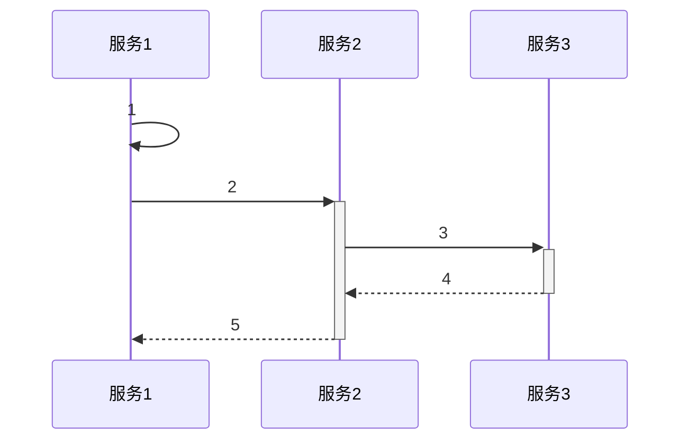

# [mermaid](https://mermaid.js.org/)

## 时序图

`->>` 实线

`-->>` 虚线

`+` `-` 激活框开关

```mermaid
sequenceDiagram
    服务1 ->> 服务1 : 1
    服务1 ->> + 服务2 : 2
    服务2 ->> + 服务3 : 3
    服务3 -->> - 服务2 : 4
    服务2 -->> - 服务1 : 5
```
